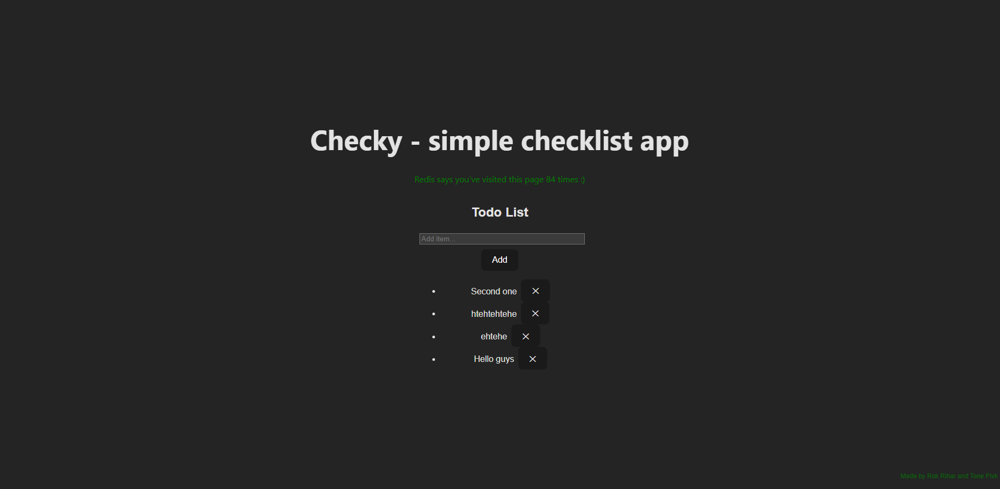

# DevOps Project – Automated Docker Application Stack

**Authors:** Rok Rihar and Tone Pivk

<p align="center">
  
</p>
The screenshot shows the fully working application stack.
The main title confirms that the backend (Flask, Gunicorn, Nginx) is running.
The green text confirms Redis connectivity.
The list below shows data coming from the PostgreSQL database.

Video showing deployment of app-stack can be seen here: https://youtu.be/Y4V5QhtVgHY

---

## Project Overview

This project demonstrates a **fully automated, containerized application stack** built according to DevOps best practices.

The application is a **simple Todo List web application**, consisting of a React frontend and a Flask backend, backed by PostgreSQL and Redis.  
The entire stack is deployed using **Docker Compose**, with container images automatically built and published using **GitHub Actions CI/CD**.

The goal of this project is to showcase:
- Infrastructure as Code
- Multi-container orchestration
- Automated image builds using BuildX
- CI/CD pipelines
- Secure deployment using TLS

---

## Application Features

- Add and view todo items
- Persistent storage using PostgreSQL
- Request counters and caching using Redis
- REST API backend
- Single-page application frontend
- Reverse proxy and TLS termination using Nginx

---

## Architecture

### Services / Containers

The stack consists of **five different services**:

| Service     | Description |
|------------|------------|
| **frontend** | React (Vite) SPA |
| **backend**  | Flask API served by Gunicorn |
| **nginx**    | Reverse proxy + TLS |
| **postgres** | PostgreSQL database |
| **redis**    | Caching and counters |

All services are orchestrated using **Docker Compose**.

---

## Technology Stack

- **Frontend:** React + Vite
- **Backend:** Python (Flask, Gunicorn)
- **Database:** PostgreSQL 16
- **Cache:** Redis
- **Reverse Proxy:** Nginx
- **Containerization:** Docker, Docker Compose
- **CI/CD:** GitHub Actions + Docker BuildX
- **Container Registry:** GitHub Container Registry (GHCR)
- **TLS:** Nginx with certificates

---

## Docker Compose

The application stack is started with a single command:

```bash
docker compose up -d
```

## Docker Compose Architecture

Docker Compose is used to orchestrate the entire application stack and handles:

- Service networking
- Dependency ordering
- Volume mounting
- Port exposure
- Persistent storage (volumes)

### Persistent Volumes

The following Docker volumes are used:

| Volume name | Purpose |
|------------|--------|
| `db-data` | PostgreSQL data persistence |
| `redis-data` | Redis data persistence |

This ensures that application data **survives container restarts and upgrades**.

---

## Custom Docker Images & Multi-Stage Builds

Both the **backend** and **frontend** are built as **custom Docker images** using **multi-stage Dockerfiles** to minimize image size and improve security.

### Backend Image

- **Builder stage**
  - Installs Python dependencies
- **Final stage**
  - Uses a minimal base image
  - Runs Flask via **Gunicorn**
  - Exposes only required runtime files

### Frontend Image

- **Builder stage**
  - Runs `npm install`
  - Builds production assets using `npm run build`
- **Final stage**
  - Uses **Nginx** to serve static files
  - Contains only compiled frontend assets

This approach keeps production images **small, fast, and secure**, following Docker best practices.

---

## CI/CD Pipeline (GitHub Actions)

Container image building and publishing is **fully automated** using **GitHub Actions**.

### Workflow Highlights

The CI/CD workflow is triggered on:

- Push to the `main` branch
- Git tags matching `v*.*.*`

The workflow uses:

- `docker/setup-buildx-action`
- `docker/metadata-action`
- `docker/build-push-action`

### Published Images

Images are built and published to **GitHub Container Registry (GHCR)**:

- `ghcr.io/rokrihar4/devops-backend`
- `ghcr.io/rokrihar4/devops-frontend`

### CI/CD Statement

> CI/CD workflow is based on the GitHub Actions lab exercise using **GHCR** and **Docker BuildX**.

This project **does not automatically deploy** new images to production.

### Deployment Flow

1. Code is pushed to GitHub
2. GitHub Actions builds and publishes container images
3. Target machine pulls the latest images
4. Docker Compose recreates the containers

### Manual Deployment Example

```bash
docker compose pull
docker compose up -d --force-recreate
```
