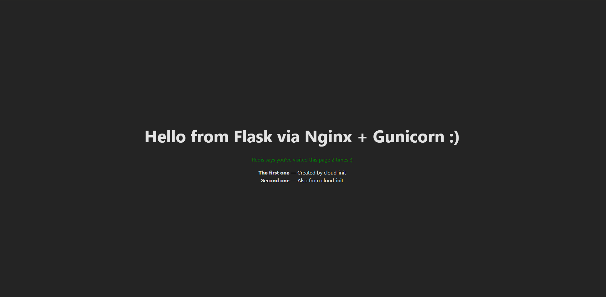

# DevOps Project – Vagrant & Cloud-init Application Stack  
Made by: Rok Rihar and Tone Pivk

<p align="center">
  
</p>

The screenshot shows the fully working application stack.  
The main title confirms that the backend (Flask, Gunicorn, Nginx) is running.  
The green text confirms Redis connectivity.  
The list below shows data coming from the PostgreSQL database.

---

## Project Overview

This project implements a complete Linux-based application stack using **Infrastructure as Code** principles.

Two automated deployment methods are provided:

- **Vagrant + shell provisioning** (local VirtualBox VM)
- **Cloud-init** (cloud-friendly provisioning, tested with Multipass)

Both approaches build the same stack:

- **Nginx** — reverse proxy and static file server  
- **React (Vite)** — frontend single-page application served by Nginx  
- **Flask + Gunicorn** — backend API  
- **PostgreSQL** — relational database  
- **Redis** — caching and hit counter service  

Everything lives in a reproducible Git repository and can be deployed end-to-end with a single command (`vagrant up` or `multipass launch --cloud-init`).

### Prerequisites

- **VirtualBox**
- **Vagrant**
- **Node.js + npm** (to build the React frontend)
- **Git**

---

## Architecture

### Components

- **Frontend (`frontend/`)**  
  - React application built with Vite.  
  - The production build (`dist/`) is synced into the VM and served from `/var/www/html/react`.  
  - Communicates with the backend via:
    - `GET /api/message`
    - `GET /api/dbdemo`

- **Backend (`app/app.py`)**  
  - Flask API wrapped with Gunicorn.  
  - Listens internally on `127.0.0.1:5000`.  
  - Endpoints:
    - `/api/message`: returns greeting, Redis hit counter, DB timestamp  
    - `/api/dbdemo`: returns rows from the `items` table  
  - Configured through environment variables:
    - `DB_DSN`
    - `REDIS_URL`

- **PostgreSQL**  
  - Database: `demo`  
  - User: `demo` / password: `demo`  
  - Table `items` with demo entries created during provisioning.

- **Redis**  
  - Handles request counters:
    - `hits`
    - `dbdemo_hits`

- **Nginx**  
  - Serves the React SPA.  
  - Proxies `/api/` to Gunicorn at `127.0.0.1:5000`.

---

## Repository Structure

```text
Devops-Projects/
├── .gitattributes
├── .gitignore
├── README.md                 # Project documentation
├── Vagrantfile               # Vagrant definition for the Ubuntu VM
├── setup-myapp.ps1           # Windows helper script
│
├── app/                      # Flask backend
│   ├── app.py
│   ├── requirements.txt
│   └── venv/                 # Local development venv (ignored in provisioning)
│
├── frontend/                 # React/Vite frontend
│   ├── src/...
│   └── dist/                 # Production build served by Nginx
│
├── provision/                # Vagrant provisioning files
│   ├── provision.sh          # Main provisioning script
│   ├── app.env               # Backend environment variables
│   ├── app.service           # Gunicorn systemd unit
│   └── nginx-default.conf    # Nginx site configuration
│
└── cloud-init/               # Cloud-init deployment
    └── user-data.yaml        # Full cloud-config to deploy the same stack
